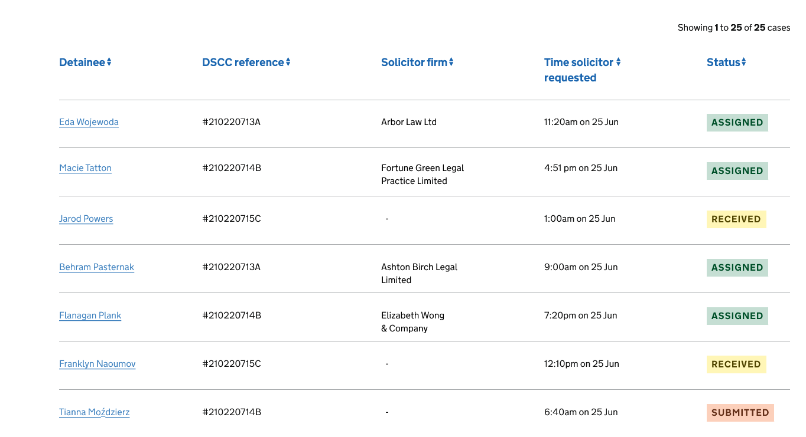
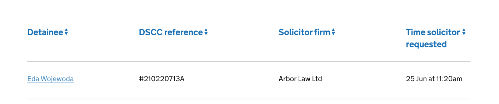
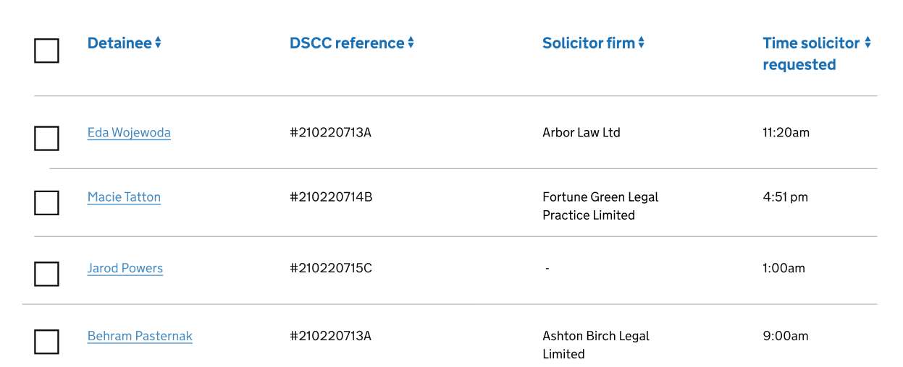
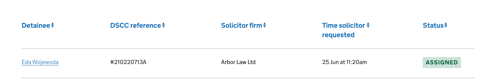

    

## When to use

Use the case list page to make pieces of information about a case easier to scan, prioritise and action for users.

## How to use

First understand what pieces of information are needed to prioritise and action cases. You should avoid using too many columns, and only provide users with information they really need. Use clear labels for column headings that describe the content.

### Order of information

Think about the order of your columns so that you display the information in a way that makes sense to the user.

User research will tell you the best default order for cases, such as by most recently updated, case number, or full name. If you want to let users reorder cases, use the  [Sortable table](https://design-patterns.service.justice.gov.uk/components/sortable-table/) component.

You may want to use [Tabs](https://design-system.service.gov.uk/components/tabs/) to let users navigate between different groups of cases, such as ‘Recently allocated’ and ‘Caseload’.

### If you’re displaying names

Use the format first-name, last-name unless user research tells you to use a different format. Further guidance is available on how to [ask users for names.](https://design-system.service.gov.uk/patterns/names/)

### If you want add a link to let users view details of a case

    

You should display the [link](https://design-system.service.gov.uk/styles/typography/#links) in the first column, and use meaningful content such as the case number or name. Avoid using words like ‘View’.

You should limit actions from the case list and allow users to perform more actions once they’re viewing details of a case.

### If you’re displaying date and times

Write out dates in full to help users read it easily, such as 16 June at 8:06am. When space is an issue you can use truncated months, such as Jan, Feb.

You can display date and time in separate columns to let users sort and filter them separately. Further guidance is available on [dates.](https://www.gov.uk/guidance/style-guide/a-to-z-of-gov-uk-style#dates)

### If you want to let users select multiple cases to perform an action on them

    

Use [multi select.](https://design-patterns.service.justice.gov.uk/components/multi-select/)

### If you want to display a status

    

Use a [tag.](https://design-system.service.gov.uk/components/tag/)
Put this at the end of a row.

### If you want to let users filter the list

Use the [filter](http://localhost:8080/components/filter/) component with the [filter a list](http://localhost:8080/patterns/filter-a-list/) pattern.

### If you want to let users search for a case

Use the [search](https://design-patterns.service.justice.gov.uk/components/search/) component. Place this before the [sortable table](https://design-patterns.service.justice.gov.uk/components/sortable-table/) component.

## Research

This page:

- has been usability tested

## Contribute

[Discuss case list pages on GitHub](https://github.com/ministryofjustice/moj-frontend/discussions/242)

### Things we don't know enough about

* **Pagination** - there’s only one page but the user will still need to know the number of cases on that page, for example, ‘Showing 1 to 25 of 25 cases’.
* **Link on the first column** -  the need for the bold font weight instead of regular.
*  [**Badge**](https://design-patterns.service.justice.gov.uk/components/badge/) - to indicate an update notification or a change made on a specific row on the table.
*  [**Notification badge**](https://design-patterns.service.justice.gov.uk/components/notification-badge/) - this hasn’t been tested but has been mentioned to use this when highlighting updates of a specific case.
* **Customise length of the list** - View x number of cases on a page.
