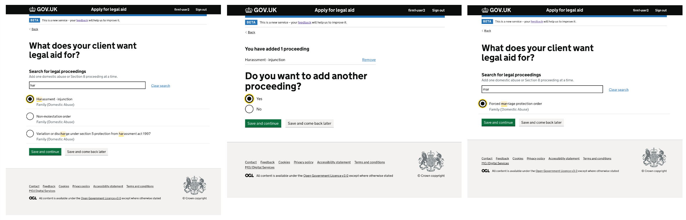
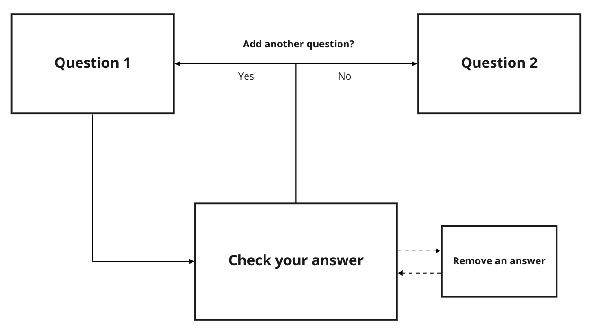
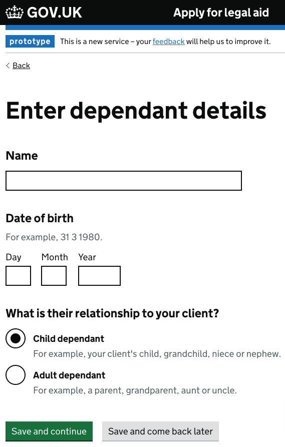
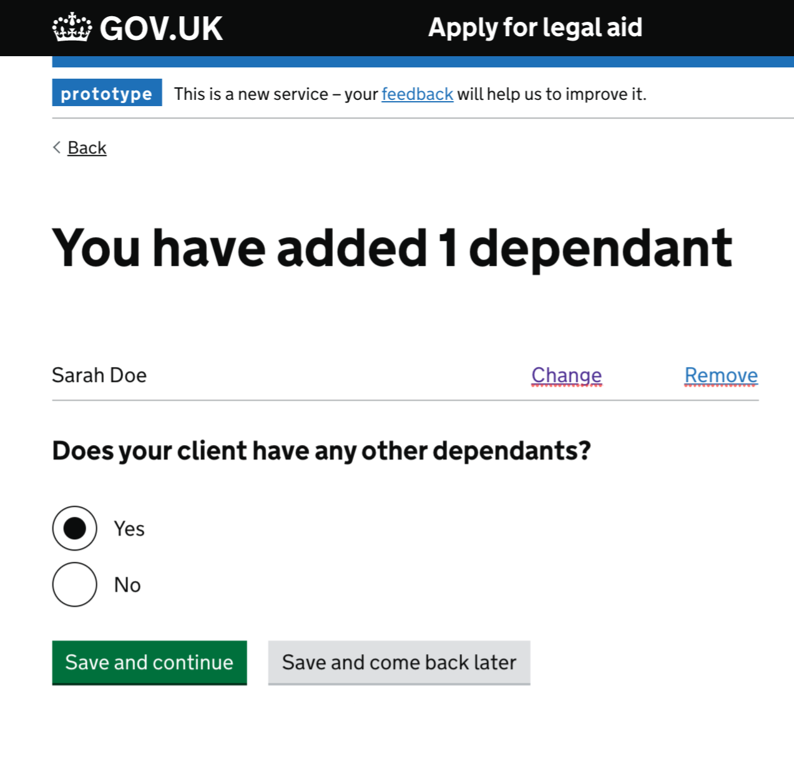
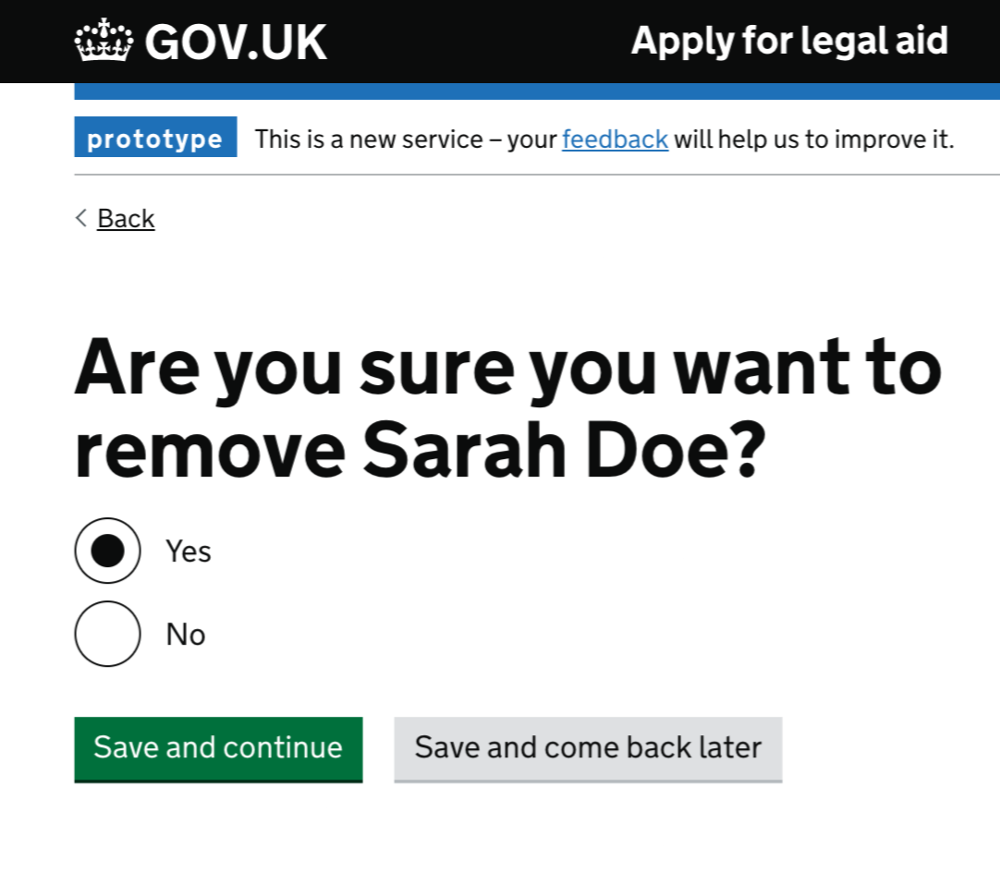


[Add to a list](https://design.tax.service.gov.uk/hmrc-design-patterns/add-to-a-list/) in HMRC Design Patterns and [add multiple things](https://design.homeoffice.gov.uk/patterns/add-multiple-things) in the Home Office Design System have a similar function and visual design to this pattern.

This pattern is in the GOV.UK Design System [community backlog](https://github.com/alphagov/govuk-design-system-backlog/issues/21) for review.


    

## When to use

Use this pattern when users need to add similar information many times, and check and add more if needed.

## When not to use

Do not use this pattern when users need to add different kinds of information that do not relate to each other.

If users only need to add information a couple of times, consider using [add another](../../components/add-another). 

## How to use

    

### Add things to the list

    

Use a [question page](https://design-patterns.service.justice.gov.uk/patterns/question-pages/) to ask users for information you need within your service. This is the information that users may need to add many times.

Use components that best suit the information you're asking for, such as [text inputs](https://design-system.service.gov.uk/components/text-input/) or [radios](https://design-system.service.gov.uk/components/radios/).

### View a summary of what they have added to the list

    

Use [summary list](https://design-system.service.gov.uk/components/summary-list/) to let users view a summary of what they have added to the list. 

Use [radios](https://design-system.service.gov.uk/components/radios/) to ask users if they want to add more things to the list. Use their answer to take users to the original question page to add similar information, or move to the next question.

You may want to add these links to the summary list:

- 'Change' link to change things on the list 
- 'Remove' link to remove things from the list

If you use a 'Remove' link, you should ask the user to confirm they want to remove something from the list.

    

## Research

This pattern:

- has been usability tested
- has had an external accessibility audit with Digital Accessibility Centre (DAC)
- is working in a live service (Apply for legal aid)

## Contribute 

[Join the discussion](https://github.com/ministryofjustice/moj-frontend/discussions/203) on GitHub.

### Things we don't know enough about 

- On the list page, should we have the page title large and the question small or the page title small and the question large. 