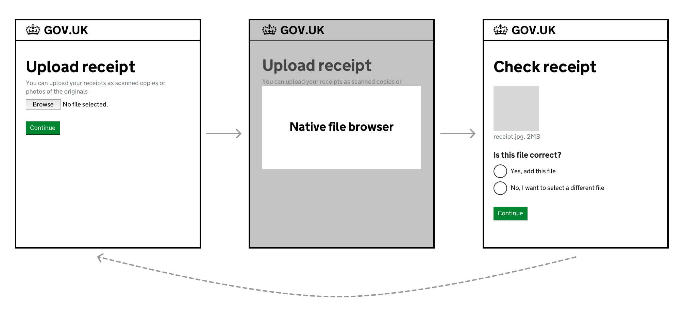

## When to use

Use this pattern whenever you need users to upload one or more files.

## When not to use

Do not ask users to upload files unless you really need to in order to deliver your service.

Uploading files can involve a number of interactions that users might find challenging, like:

- scanning a document or taking a photo
- sending a file from one device to another
- selecting a file from a folder
- waiting for a file to be uploaded

## How to use

How you help users upload files depends on whether they need to upload:

- a single file
- multiple files, one at a time
- multiple files at the same time

### Help users upload a single file

Use the [file upload component in the GOV.UK Design System](https://design-system.service.gov.uk/components/file-upload/) to let users upload a single file.



Once users have uploaded their file, let them check it’s the right one by showing a preview.

For files where a preview might be difficult to check, consider how you can help users check the information.

For example, if the file is a spreadsheet, you could show its contents in a table.



### Let users upload additional files

If users need the option to upload more than one file, include an additional screen asking if they want to upload another.



### Deleting a file

What happens when a user deletes a file depends on whether the list contains 1 file or multiple.

If there's multiple files in the list, display a success message at the top of the page.



If there's 1 file in the list, take users to the upload screen with a success message at the top of the page.



### Let users upload multiple files at once

When users need to upload multiple files, start by letting them upload one file at a time, as shown in the previous example.

This is the simplest approach, especially for users with low digital literacy.

However, in services designed for regular and repeated use, like caseworking systems, it might be more helpful to let users upload multiple files at once.

Only take this approach if user research shows uploading files one at a time is problematic.

To let users upload multiple files at once, use the [multi file upload component](/components/multi-file-upload).

### Let users enter additional information about their files

Files often have long, meaningless names by default, so you can let users enter a friendly name to make them easier to find later.

You can also let users provide a description of what a file contains, if research shows this is useful.

If you do add additional fields, show the answers on the check screen along with the file.

### Accept multiple file types

Let users upload as many different file types as possible. You can convert them automatically if you need to. If you must limit file types, let users know by using hint text.

### Reduce file size automatically

Wherever possible, let users upload large file sizes.

When showing users a preview of a large file to check, consider if you can show a smaller version of that file so that it loads faster.

If you do this, you can store the original file and give users the option to view it if they need to.

### Error messages

Use the [file upload error messages from the GOV.UK Design System](https://design-system.service.gov.uk/components/file-upload/#error-messages).